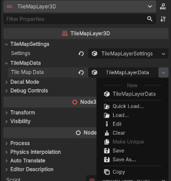
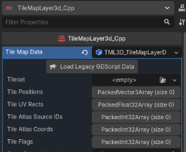

# Migration Guide: from the GDScript versions (1.x) to the C++ version (2.x)

For the purpose of this guide, the GDScript versions (1.x) are called **"legacy"**. The C++ / GDExtension version (2.x) is called the **"new plugin"**.

The two are separate addons:

| | Legacy (1.x) | New plugin (2.x) |
| --- | --- | --- |
| Addon folder | `addons/TileMapLayer3D` | `addons/tilemap_layer_3d_cpp` |
| Plugin name | TileMapLayer3D | TileMapLayer3D (C++) |
| Node type | `TileMapLayer3D` | `TileMapLayer3d_Cpp` |
| Data resource | `TileMapLayerData` | `TML3D_TileMapLayerData` |

Scenes are **not** converted automatically. You import each legacy node's tile data into a new `TileMapLayer3d_Cpp` node with a one-time, manual step.

> **Back up your project before migrating.**

## Section 1: Data Migration

### What gets imported

| Imported | Not imported (set up again on the new node) |
| --- | --- |
| All placed tiles: positions, textures (UVs), atlas bindings, orientation, rotation, mirror and tilt | Node settings: Grid Size, texture filter, Pixel Inset, collision layer/mask, render priority |
| The `TileSet` (including terrains and custom data) | Animation **definitions** (the list in Animated Tiles mode) |
| Ramp tiles and other tiles with custom transforms | Generated collision shapes (run **Create Collision** again) |
| Vertex-edited tiles | The AutoTile terrain selection and other tool state |
| Animation data on tiles you already placed (they keep animating) | |

Legacy tiles placed with **Freeze UV** are converted so they look the same in the new plugin.

### Step by step

1. Install the new plugin next to the legacy one, and make sure **both plugins are installed and enabled** in `Project -> Project Settings -> Plugins`. The import needs the legacy addon to read the legacy data.
   - Some errors might show up while both are installed; ignore them for now. They go away once the migration is finished and the legacy addon is removed.
2. Select a legacy `TileMapLayer3D` node. In the Inspector, save its **Tile Map Data** (`TileMapLayerData`) to a file with **Save As**. You must save it as **`.tres`** (change the extension before saving).

   

3. Add a new plugin node (`TileMapLayer3d_Cpp`) to the scene and select it.
4. In its Inspector, open the **Tile Map Data** (`TML3D_TileMapLayerData`) property and click **Load Legacy Data**. Select the legacy `.tres` file you saved. The tiles should load.
   - **This replaces all tile data on that node.** Use an empty node.
   - The screenshot below shows the button's earlier name, *Load Legacy GDScript Data*. The current builds call it **Load Legacy Data**.
   - You might need to reload the Godot project to make sure all tiles appear correctly.

   

5. Set up the things that are not imported: match **GridSize**, **Filter** and **Pixel Inset** (Settings mode) to your legacy node, check **Tile Set Size** (Manual mode), recreate your animation definitions, and run **Create Collision**.
6. Repeat steps 2–5 for every legacy node in every scene, then delete the legacy `TileMapLayer3D` nodes from your scenes.
7. Once all your data is migrated, you **MUST**:
   - Deactivate the legacy plugin.
   - Delete the legacy plugin from the `addons` folder.
   - Restart the project once again.

### If the import fails

| Error in the Output panel | What to do |
| --- | --- |
| `legacy tile flags format v0/v1 is not supported` | The data was saved by a very old 1.x release. Open the scene with the legacy plugin (which upgrades the data), save it, export the data again (step 2), and retry. |
| `source is neither a TileMapLayerData nor a TML3D_TileMapLayerData` | The legacy plugin is not installed and enabled, or you picked the wrong file. |
| `could not load resource or it is invalid` | The file could not be loaded. Check the path and that the legacy plugin is enabled. |

> **Importing data from an earlier 2.x build:** the same **Load Legacy Data** button also accepts a `TML3D_TileMapLayerData` saved by an earlier build of the new plugin, including its patterns and scatter data.

## Section 2: Exclusive features of the new plugin (C++ version)

The features below are available only in the new C++ / GDExtension plugin. This is a high-level summary; see the [How-To Guide](HOW_TO_GUIDE.md) for the detailed workflows and the plugin's core concepts.

### AutoShape Mesh

**What it is:** `AUTOSHAPE_MESH` creates an extruded 3D mesh from the non-transparent silhouette of the selected atlas tile.

**How it works:** The plugin reads the tile's alpha channel, generates and caches a mesh for that atlas region, then renders its instances in regional MultiMesh chunks. Fully opaque tiles automatically use a Box mesh instead.

**How to use it:** In Manual, AutoTile or Animated Tiles mode, select a tile and choose `AUTOSHAPE_MESH` in **Mesh Type**. Set **Depth**, **Texture Repeat** and **Depth Inwards** as needed, then paint normally. You can also select existing tiles in Smart Operations and use **Replace Mesh Type** with AutoShape as the target.

**Known limitations:**

- **Freeze UV is always off** for AutoShape. Texture rotation turns the mesh too, because the geometry is cut from the texture.
- **Mirror Texture is unsupported for non-solid AutoShape tiles.** The geometry is generated from the original tile's alpha silhouette, so mirrored asymmetric or partially transparent textures no longer line up with the mesh and can look broken. Fully opaque tiles that use the Box mesh fallback are unaffected.

### Patterns Fill

**What it is:** Patterns Fill is a reusable copy-and-place library for complete tile arrangements. A pattern can contain different UVs, mesh types, orientations, transforms and vertex-edited tiles.

**How it works:** Patterns are stored in the node's `TML3D_TileMapLayerData`. The tile nearest the centre of the saved selection is the placement reference. Selecting a pattern shows a viewport preview; placing it stamps the entire arrangement and replaces tiles occupying the target cells.

**How to use it:**

1. Open `Smart Operations -> Patterns` and select the tiles to reuse. This works just like Smart Select. Enable **Add** (Additive, shortcut `Z`) to build the selection over several clicks or select types.
2. When you are happy with the selected tiles, click **New** in the bottom panel to store the selection as a pattern.
3. To place a pattern, click its card, move the preview to the required grid position, and left-click to place a copy. Right-click, or click the selected card again, to exit pattern placement.

> Patterns Fill is part of **Smart Operations**. Each `TML3D_TileMapLayerData` resource owns its own pattern library. Stamping is undoable; creating and deleting patterns is not.

### Scatter Mode

**What it is:** Scatter Mode is an object-scattering system for painting meshes such as grass, plants, rocks and props alongside the tile map. Scatter objects are stored separately from tiles but stay aligned with the TileMapLayer3D coordinate, grid and region systems.

**How it works:** A Scatter Item defines a mesh and optional material override, probability weight, minimum spacing and randomness, surface alignment, rotation behaviour, scale range, shadows and visibility range. All enabled items are mixed by the brush. Instances are saved in `TML3D_TileMapLayerData` and rendered efficiently through regional `RenderingServer` MultiMesh chunks.

**How to use it:**

1. Select **Scatter** mode, click **New** in the Scatter panel, and configure the new `TML3D_ScatterItemDefinition` in the Inspector. Replace its default `QuadMesh` with your mesh, and tick **Enabled** on every item the brush may use.
2. Choose **Surface** = `Grid` to paint on the active grid plane (like tiles), or **Surface** = `Collision` to paint on physics surfaces using the **Col.Mask** collision mask.
3. To place items: choose **Mode** = `Paint`, set **Size** (brush radius) and **Density**, then left-click or drag to scatter. Right-click or drag removes the enabled item types inside the brush.
4. To change item sizes: choose **Mode** = `Scale`. Left-drag grows instances, `Shift` + left-drag or right-drag shrinks them, and `Ctrl` + left-drag resets their scale. **Str** sets the strength. **Clear All** removes every placed scatter instance.

Scatter painting and editing support Undo/Redo. Deleting a Scatter Item also removes the instances that use it.

### AnimatedGroup runtime playback

**What it is:** Newly created Animated Tile definitions can identify every placed tile belonging to the same multi-tile object. The Runtime API can pause the complete object on its currently visible frame, resume without jumping, change its speed without jumping, or display a selected frame.

**How it works:** The plugin marks every atlas cell of an animation with the `Animated` custom data. It also writes the same sorted list of frame-zero atlas coordinates to the `AnimatedGroup` (`PackedVector2Array`) custom data on every frame-zero cell. Placed animated tiles keep their frame-zero atlas coordinates (animation only changes the UV frame shown by the shader), so a `TML3D_PlacedTileInfo` returned by a lookup or raycast resolves its group whatever frame is visible. A stale tile info, a deleted tile or missing metadata returns failure instead of modifying a different tile.

**How to use it:** Pass a `TML3D_PlacedTileInfo` from any placed member of the group:

```gdscript
var tile_info: TML3D_PlacedTileInfo = tile_map.runtime_api.get_first_tile_from_raycast(
	ray_origin, ray_direction, 5.5
)
if tile_info:
	tile_map.runtime_api.pause_animated_group(tile_info)
	tile_map.runtime_api.set_animated_group_frame(tile_info, 2)
	tile_map.runtime_api.set_animated_group_speed(tile_info, 8.0)

	var state: Dictionary = tile_map.runtime_api.get_animated_group_playback_state(tile_info)
	print(state.current_frame, state.effective_speed, state.paused)
```

- Frame indices are zero-based. `set_animated_group_frame(tile_info, frame)` displays and holds the requested frame; pass `true` as the third argument to continue playing from it.
- `set_animated_group_speed(tile_info, 0.0)` pauses on the visible frame; a positive speed resumes from the same frame without an immediate jump. `resume_animated_group()` uses the retained positive speed and returns `false` when no positive authored or runtime speed exists.
- `get_animated_group_playback_state()` returns `valid`, `current_frame`, `effective_speed`, `paused`, `total_frames` and `tile_keys`. Runtime playback state belongs to the running node and is not saved; the authored speed is unchanged.
- New definitions support up to 255 frames and 255 columns. Runtime speeds are limited to `0.0–255.0` FPS with 0.01 precision.
- Definitions created before this feature have no group metadata. Recreate them to enable group control; group calls return `false` without changing tiles until then. Already placed animated tiles keep rendering normally.
- Creating an overlapping group replaces the previous group assignment. Deleting a definition leaves its TileSet metadata in place, so already placed animated objects stay controllable.
- Creating a definition marks both the scene and the TileSet as modified. Use the normal save action (`Ctrl+S`, or save before running) to keep them.
- **Not available with the Compatibility renderer**, which every Web export uses. There, animated tiles play at their authored speed and the group playback methods return `false`.

### Reworked Runtime API and tile picking

**What it is:** Every `TileMapLayer3d_Cpp` node exposes `runtime_api` for querying and modifying the tile map during gameplay.

**How it works:** The API works with `TML3D_PlacedTileInfo` for placed-world data and Godot `TileData` for atlas, terrain and custom data. World/grid conversions and ray picking respect the node's complete transform, including rotation and scale. Picking also handles vertex-edited tiles and returns the nearest hit without modifying saved tile data.

Common operations include:

| Task | Main methods |
| --- | --- |
| Find tiles | `find_tile()`, `get_first_tile_from_raycast()` |
| Read TileSet data | `get_tile_data_from_key()`, `get_tileset()`, `get_variant_tile_data()`, `get_collection_tile_data()` |
| Edit tiles | `place_tile()`, `erase_tile()`, `place_area()`, `erase_area()` |
| Swap tile visuals | `swap_tile_texture()`, `swap_tile_collection_texture()` |
| Control animated groups | `pause_animated_group()`, `resume_animated_group()`, `set_animated_group_speed()`, `set_animated_group_frame()` |
| Convert coordinates | `world_to_grid_snapped()`, `grid_to_world_snapped()` |
| Update feedback / collision | `highlight_tile()`, `highlight_area()`, `clear_highlights()`, `set_collision_for_region()` |

Minimal ray-pick example:

```gdscript
var tile_info: TML3D_PlacedTileInfo = tile_map.runtime_api.get_first_tile_from_raycast(
	ray_origin, ray_direction, 5.5
)
if tile_info:
	var tile_data: TileData = tile_map.runtime_api.get_tile_data_from_key(tile_info.tile_key)
```

> `set_collision_for_region()` returns a request id and finishes asynchronously: connect to the API's `bake_completed` and `bake_failed` signals. `swap_tile_collection_texture()` returns immediately and needs no `await`.

The complete method signatures, examples and return values are in the [Runtime API section of the How-To Guide](HOW_TO_GUIDE.md#14-runtime-api) and in Godot's built-in help (search for `TML3D_RuntimeAPI`).

### UV Only painting

**What it is:** **UV Only** repaints the texture of tiles that already exist, without touching their geometry. Mesh type, mesh rotation, depth and orientation are left exactly as they were.

**How it works:** With UV Only enabled, painting no longer creates tiles. Each cell under the brush is checked for an existing tile; if one is found only its UV (and, in AutoTile mode, its terrain mark) is rewritten, and empty cells are skipped. Because nothing is rebuilt, retexturing an existing structure no longer resets work done with Box, Prism or Arch meshes.

**How to use it:** Enable the **UV Only** checkbox in the context toolbar, select the atlas tile you want to apply, and paint. It works in Manual and AutoTile modes, with single clicks, drag strokes and area fill.

- In **Manual** mode the selected atlas tile is applied to the existing tile.
- In **AutoTile** mode the existing tile is marked with the active terrain and the AutoTile solver resolves its UV, including the neighbouring tiles. Erasing with UV Only removes the terrain mark from the tile instead of deleting it.

> Limitations: repainting an animated tile makes it static. AutoShape tiles regenerate their silhouette from the new atlas tile, because their geometry comes from the texture's alpha. Vertex-edited tiles and Smart Fill ramp/stair pieces are not repainted.

### Smart Fill - Fill Stairs

**What it is:** **FILL STAIRS** is a second Smart Fill mode, next to **FILL RAMP**. It builds a complete staircase between two points, including treads, risers, side panels and the fillers below them.

**How it works:** You pick a start tile and an end tile, and the plugin generates the stair layout between them as off-grid tile slices with exact custom transforms. The step meshes are internal to Fill Stairs and are intentionally not offered in the Mesh Type menu. Placement and preview share the same layout, so what the viewport preview shows is what gets placed.

**How to use it:**

1. Open `Smart Operations -> Smart Fill` and select `FILL STAIRS`.
2. Click the start tile and then the end tile. The preview updates as you move the mouse between the two clicks.
3. Use **Width** to widen the run, and **Sides** to fill the two outer sides of the staircase down to the lower landing.
4. Leave **Steps** on **Auto** to derive the step count from the length and height of the staircase, or uncheck **Auto** and set a total step count manually. Manual counts are multiples of four and describe the total number of steps from the lower landing to the upper landing, independently of the width. More steps make each riser shorter and each tread shallower.
5. **Freeze UV** (enabled by default) keeps the texture orientation aligned with the working-plane grid in quarter turns; diagonal staircases use the nearest quarter turn. With it disabled, the texture follows the staircase's own frame. Either way the side panels and the fillers stay aligned with each other.

> Freeze UV controls texture *orientation* only. Proportional UV mapping is not part of this release: the selected atlas tile is applied with the default mapping, so treads and risers may appear stretched depending on the staircase proportions.

### Reworked keyboard shortcuts and FastMove

**What it is:** All plugin keyboard input now runs through a single consolidated handler, which resolves the previous conflicts with Godot's built-in editor shortcuts. It also adds **FastMove** for jumping the 3D cursor across the scene, and a configurable cursor movement speed.

**How it works:** Shortcuts are matched on *physical* key positions and exact modifier chords, so they behave the same on every keyboard layout and never fire while Ctrl, Alt or Meta is held. The plugin only takes a key when a `TileMapLayer3d_Cpp` node is selected and the 3D viewport has focus, which keeps Godot's own shortcuts working. Keys are also released correctly when the editor loses focus, so held keys no longer get stuck.

**Shortcuts:**

| Keys | Action |
| --- | --- |
| `W` / `S` / `A` / `D` | Move the 3D cursor forward / backward / left / right, relative to the camera |
| `Shift + W` / `Shift + S` | Move the 3D cursor up / down |
| `Q` / `E` | Rotate the tile left / right |
| `R` / `Shift + R` | Tilt the tile forward / backward |
| `F` | Mirror the texture |
| `G` / `Shift + G` | Rotate the texture inside the tile by 90° (new) |
| `T` | Reset rotation, tilt, mirror and texture rotation |
| `Z` | Toggle `Additive` in Smart Select and Patterns |
| `Delete` | Delete the selected tiles in Vertex Edit mode |
| `Esc` | Cancel the current area selection or sculpt operation |
| `Shift + Space` + `Left-click` | FastMove: jump the cursor and grid to the clicked tile, so you can continue painting aligned to it |

`Q`, `E`, `R`, `F`, `G` and `T` do nothing in AutoTile, Animated Tiles and Vertex Edit modes.

**FastMove:** hold `Shift + Space` and left-click any tile in the viewport to move the 3D cursor and its grid plane to that tile. This is meant for navigating large scenes without stepping the cursor there one cell at a time. FastMove works while the 3D cursor is in use and tiling is **On**, and only accepts tiles on the plane you are facing.

**Cursor Speed:** set the base cursor speed (1–60 steps per second) in Settings mode. Holding a movement key accelerates to 4x over two seconds.

### Double Flat Tile and Texture Rotation

- **Double Flat Tile** places the back face of every new flat tile (squares, triangles and arches), so walls are visible from both sides. While enabled, erasing a face also erases its back face. Available in Manual, AutoTile, Animated Tiles and Sculpt modes; Box, Prism and AutoShape tiles are skipped.
- **Texture Rotation** (`UV 0°` button, `G` / `Shift + G`) turns the texture inside a tile in 90° steps without turning the geometry. **Freeze UV** is now a placement-time option: it never changes tiles you have already placed, and while it is on, Texture Rotation is locked at 0°.

### Sculpt on every plane

Sculpt mode now works on the floor, the ceiling and all four walls (the working plane follows the camera and locks while you draw). Its brushes are **Diamond**, **Square**, **Erase** and **Arched Rect** in four sizes, and **Box/Prism (Depth)** builds Square and Diamond volumes from inward-growing Box and Prism meshes.

### Smooth Pixel filter and Compatibility renderer

- New **Smooth Pixel** texture filter (Settings mode): texels stay crisp and only their edges are blended over about one screen pixel, so pixel art stays stable at non-integer scales and during camera movement.
- All texture filters are computed in the tile shader, so Forward+ and Compatibility now filter identically.

### Decal Mode changes

`enable_decal_mode` still lets one node render flat tiles as overlays on top of another. The legacy `decal_target_node` property no longer exists, and render priority is no longer raised automatically: if overlays draw behind the base layer, raise `render_priority` in the decal node's `settings -> Rendering`.

### Other C++ version improvements

- **Finer placement:** Grid Snap and Cursor Step controls are now on the main toolbar and include `0.25` steps. The tile-key data model was expanded to support the finer coordinate lattice (0.05 precision) and a much larger coordinate range (about ±13,107 grid units).
- **Arch tiles:** corner caps and side walls now generate matching vertex counts, which removes the small gaps that could appear at arch corners.
- **Smart Select:** Additive selection works across all select types. Mesh replacement supports AutoShape and preserves custom tile transforms more reliably.
- **Animated and vertex tiles:** animated tiles can use Flat Square, Box, Prism or AutoShape meshes. Vertex-edited tiles can be saved and placed inside patterns.
- **Platforms:** prebuilt debug and release libraries for Windows x86_64, Linux x86_64, macOS (universal) and Web (wasm32, no threads).
